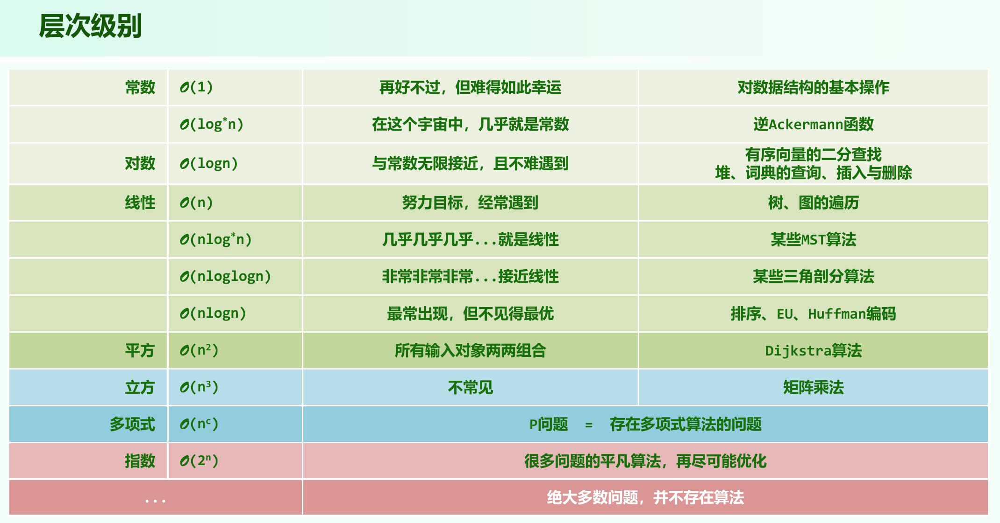

# 01C 渐近复杂度

## 主流长远

大O标记，不追求尺子的精度，而是定性和定量达到一种折中。

:::note

科学记号在科学发展中有重要作用。

:::

alan turing 和 陶渊明 说过类似名言, 忽略细枝末节，关注主流的长远的趋势。

渐进分析(asymptotic analysis): 关心问题规模足够大后，计算成本如何增长？

## 大O记号(big-O notation)

```sh
// paul bachmann, 1894
T(n) = O( f(n) ) 如果存在一个常数 c >0, 当 n >> 2 后, 有 T(n) < c * f(n) 
```

T(n) 与 f(n) 相比更为简洁， 但依然可以反应前者的增长趋势。

大O标记的两个常用处理手法:

- 常数系可忽略 O( f(n) )  = O(  c * f(n) )  
- 低次项可忽略 O( n<sup>a</sup> +  n<sup>b</sup> )  = O( n<sup>a</sup>), a > b > 0

渐进分析其它标记:

大 Ω 标记， 算法的下界， 即最好情况。

大 Θ 标记，同时界定算法的上下界。

## 高效解

- O(1) 常数复杂度。 无论常数多大。不含转向(循环，调用，递归等)，顺序执行，一定是常数复杂度。
- O(logn) 对数复杂度。常数底无所谓。常数次幂无所谓。对数多项式。

## 有效解

- O(n<sup>c</sup>) 多项式复杂度。其中 O(n) 为线性复杂度，很多编程习题主要覆盖 O(n) 到 O(n<sup>2</sup>) 范围，否则难度大大增加。

## 难解

- O(a<sup>n</sup>) 指数复杂度。从多项式复杂度到指数复杂度，是有效算法到无效算法的分水岭。

## 2-subset

s 包含 n 个正整数，它能否分成和相等的两部分？这个例子的特例是美国大选，两个总统选举票数是否可能相等。

定理:2-Subset is NP-complete。

## 增长速度



