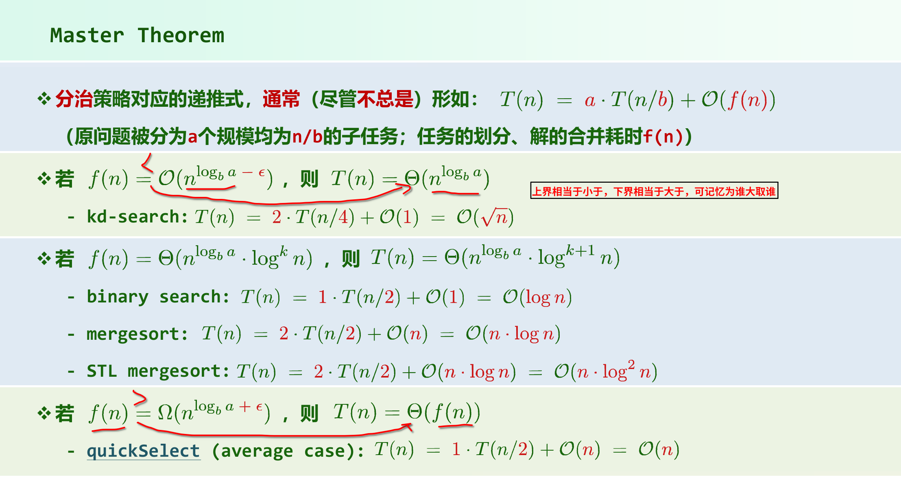

# 01E 迭代与递归

## 计算任意n个整数之和

迭代法 Θ(n) 

## 减而治之

将其划分为两个子问题:其一平凡,另一规模缩减 O(n)

## 递归跟踪

递归跟踪估算复杂度，为线性递归，O(n)

## 递推方程

递推方程估算复杂度，递归基， 规模单调减:  
  T(n) = T(n-1) + O(1)
  T(0) = O(1)

## 数组倒置

递归版， 减而治之

迭代原始版， 精简版

## 分而治之(Divide-and-Conquer)

大问题将其划分为若干子问题

## 二分递归:数组求和

递归实例个数 -》 O(n)

递推方程 -》O(n)

## 大师定理

 分治策略对应的递推式,通常(尽管不总是)形如: T(n) = a * T(n/b) + O(f(n))
(原问题被分为a个规模均为n/b的子任务;任务的划分、解的合并耗时f(n))

可以用大师定理快速推算递归复杂度。

